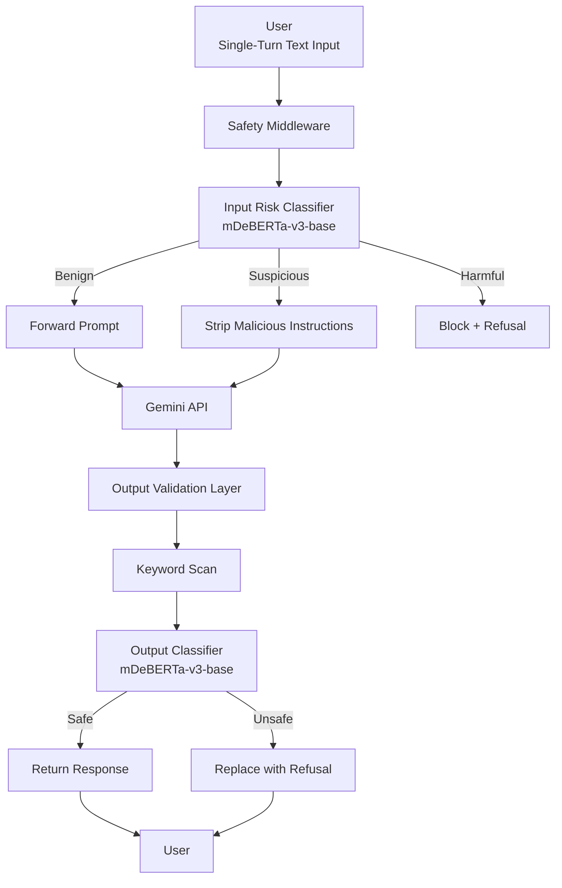

# Milestone 1  
## Inference-Time Guardrails for Mitigating Prompt Jailbreak Attacks  

---

# 1. Problem Definition  

## 1.1 Background  

Large Language Models are increasingly deployed in real-world systems such as customer support agents, productivity assistants, and enterprise automation platforms. Despite post-training alignment techniques such as Reinforcement Learning from Human Feedback, these systems remain vulnerable to adversarial prompt manipulation.

Prompt jailbreak attacks exploit instruction-following behavior through role-play framing, instruction overrides, and prompt injection. These attacks can bypass safety mechanisms and induce harmful or policy-violating outputs. In production settings, such failures introduce legal, compliance, reputational, and operational risks.

Current defenses are largely static, embedded within the model, and difficult to update without retraining. There is a clear need for modular, deployable, inference-time safety mechanisms that operate independently of the base model while maintaining low latency and preserving task performance.

---

## 1.2 Problem Statement  

This project addresses the lack of production-ready inference-time safety middleware capable of detecting and mitigating adversarial jailbreak attempts in real time.

Specifically, the system must:

1. Detect malicious or adversarial prompts before they reach the model  
2. Sanitize suspicious prompts without altering legitimate task intent  
3. Validate generated outputs before returning them to the user  
4. Maintain high task utility and low false refusal rates  
5. Operate within strict latency constraints  

The goal is to design a modular guardrail layer that operates between the user interface and the Gemini API without modifying the internal model.

---

## 1.3 Scope and Boundaries  

To ensure feasibility within the course timeline, the scope is defined as follows:

### Covered Threats  

Text-based jailbreak prompts including:

- Role-play manipulation  
- Instruction overrides  
- Prompt injection  

### Modalities  

Single-turn text interaction only  

### Out of Scope  

- Multimodal inputs (image or audio)  
- Code execution vulnerabilities  
- Multi-turn context poisoning  
- White-box adversaries  

### Architectural Constraints  

- Middleware between frontend and Gemini API  
- No modification or retraining of the base LLM  
- Deterministic deletion-based rewriting only  

### Performance Constraint  

Total additional latency introduced by the guardrail must remain below **300 milliseconds per request**.

---

## 1.4 Relevant Stakeholders  

- **AI Developers and Engineers**  
  Require modular safety components for deployment in black-box API environments.  

- **Product Owners and Organizations**  
  Concerned with compliance, brand protection, and liability reduction.  

- **End Users**  
  Benefit from safer and more reliable AI interactions.  

- **Model Providers**  
  May integrate external guardrails without modifying core alignment systems.  

---

## 1.5 Project Objectives  

The project will be evaluated against measurable targets:

1. Fine-tune an mDeBERTa-v3-base classifier for three-class prompt risk detection.  
2. Achieve at least **70 percent reduction** in Attack Success Rate compared to an unprotected baseline.  
3. Maintain a **False Refusal Rate below 10 percent** using XSTest.  
4. Preserve task utility with **MT-Bench performance within 90 percent** of baseline.  
5. Ensure total guardrail latency overhead remains below **300 milliseconds**.  

---

# 2. Literature Review and Existing Solutions  

This section reviews prior academic research, industry tools, and benchmark-driven evaluations related to prompt injection defense and LLM safety. The goal is to position our approach within the broader research landscape and identify measurable gaps.

---

## 2.1 Training-Time Alignment Approaches  

### Reinforcement Learning from Human Feedback (RLHF)

RLHF has become the dominant paradigm for aligning large language models with human preferences. Models such as GPT-4, Claude, and Gemini rely heavily on reward-model-guided policy optimization to reduce harmful outputs.

**Strengths**

- Safety behavior embedded directly in model weights  
- No additional inference-time overhead  
- Strong performance on cooperative benchmarks  

**Limitations**

- Vulnerable to adversarial prompt engineering  
- Safety policies are static after deployment  
- Updates require costly retraining  
- Cannot be modified in closed-source APIs  

Recent empirical studies show that even strongly aligned models experience high Attack Success Rates under adversarial prompting. JailbreakBench reports ASR values exceeding **60–80 percent** for certain aligned models when subjected to structured role-play attacks.

This indicates that training-time alignment alone is insufficient under adversarial input distributions.

---

### Constitutional AI  

Constitutional AI introduces rule-based self-critique during training, improving refusal robustness under benign prompts.

**Strengths**

- Scalable alignment without heavy human labeling  
- Improved refusal behavior under cooperative scenarios  

**Limitations**

- Still susceptible to instruction override attacks  
- Does not explicitly model adversarial distribution shifts  
- No independent inference-time verification  

Empirical evaluations on JailbreakBench indicate that constitutional-style models reduce some unsafe generations but do not eliminate structured jailbreak success.

---

## 2.2 Prompt-Level and System Prompt Defenses  

### System Prompt Hardening  

Many deployments rely on stronger system prompts to constrain model behavior.

**Strengths**

- Minimal engineering complexity  
- No added latency  

**Limitations**

- System prompts can be overridden  
- No formal robustness guarantees  
- Vulnerable to context-window injection  

Recent adversarial evaluations demonstrate that role-play framing and instruction override phrasing can bypass hardened system prompts with high success rates.

---

### Context Isolation in Retrieval-Augmented Generation  

Research in RAG systems proposes separating retrieved documents from user instructions to reduce prompt injection risks.

**Strengths**

- Effective against retrieval-layer injection  
- Reduces cross-contamination between context sources  

**Limitations**

- Does not address direct jailbreak prompts  
- Limited applicability outside RAG architectures  

---

## 2.3 Rule-Based Filtering  

Keyword filtering and regex-based blocklists remain widely used in production.

**Strengths**

- Extremely low latency  
- Easy deployment  

**Limitations**

- High False Refusal Rate  
- Easily bypassed via paraphrasing  
- No semantic understanding  

Studies comparing deterministic filtering to semantic classifiers show that rule-based systems fail against obfuscated jailbreak prompts and produce excessive over-refusals on benign prompts such as technical terminology (e.g., “kill a process”).

---

## 2.4 LLM-as-a-Judge Frameworks  

Some safety pipelines use a secondary large language model to evaluate safety of outputs.

**Strengths**

- Strong contextual reasoning  
- Flexible policy enforcement  

**Limitations**

- High latency overhead  
- High computational cost  
- Not suitable for strict sub-300ms production constraints  

While LLM-as-a-judge improves safety detection accuracy, it introduces unacceptable inference latency for real-time deployment.

---

## 2.5 Small Specialized Safety Models (SSM)  

Recent work demonstrates that lightweight transformer classifiers can detect adversarial prompts with low latency.

Meta’s PromptGuard (86M parameter mDeBERTa-v3-base) represents a state-of-the-art example of this approach. Reported results show:

- Strong semantic detection of prompt injection  
- Sub-100ms inference on optimized hardware  
- Significant reduction in jailbreak success compared to keyword baselines  

However, existing SSM approaches typically focus only on input-side classification and do not incorporate structured output validation layers.

Additionally, benchmark results indicate that standalone classifiers may still allow certain adversarial generations if output is not independently verified.

---

## 2.6 Benchmark-Driven Evaluation  

The following standardized benchmarks are used across recent safety research:

### JailbreakBench  

Used to measure Attack Success Rate under adversarial prompting.  
Provides structured adversarial categories including role-play, instruction override, and obfuscation.

### XSTest  

Measures exaggerated safety and contextual false refusals.  
Prevents systems from becoming overly restrictive.

### MT-Bench  

Evaluates task performance and conversational quality.

These benchmarks enable reproducible comparison and prevent training contamination.

---

# 3. Gap Analysis and Contribution  

## 3.1 Limitations of Existing Approaches  

Existing defenses fall into three primary categories:

- **Training-time alignment**  
  Fails under adversarial prompt manipulation and cannot be modified in black-box deployments.

- **Keyword-based filtering**  
  Lacks semantic understanding and produces high False Refusal Rates.

- **Single-layer semantic classifiers**  
  Detect malicious inputs but do not validate model outputs, leaving residual risk.

Even state-of-the-art Small Specialized Models such as PromptGuard operate primarily at the input classification level. They do not incorporate structured, dual-stage verification pipelines combining transformation and output validation under strict latency constraints.

Furthermore, prior work typically optimizes either safety or latency, but rarely formalizes measurable trade-offs across:

- Attack Success Rate reduction  
- False Refusal Rate control  
- Task utility preservation  
- Strict latency budgets  

---

## 3.2 Novelty of the Proposed Approach  

The proposed system introduces three key contributions:

### 1. Dual-Layer Defense-in-Depth  

Unlike single-stage classifiers, the system implements:

- Input risk classification  
- Deterministic transformation  
- Output validation via rule-based and semantic verification  

This reduces residual attack pathways that survive initial detection.

---

### 2. Constrained Transformation Strategy  

Rather than fully rewriting prompts or relying purely on blocking, the system applies deletion-only sanitization.

This preserves semantic intent while removing adversarial meta-instructions, reducing over-refusal risk.

---

### 3. Joint Optimization of Safety and Utility  

The architecture is explicitly evaluated against four simultaneous constraints:

- At least 70 percent reduction in Attack Success Rate  
- Less than 10 percent False Refusal Rate  
- At least 90 percent utility preservation via MT-Bench  
- Less than 300ms latency overhead  

Most prior systems optimize one dimension in isolation. This project formalizes a multi-objective evaluation framework aligned with real-world deployment constraints.

---

## 3.3 Why Dual-Layer Validation is Superior  

Single-stage defenses assume correct classification of adversarial prompts before generation. However:

- Adversarial inputs may evade classification.  
- Model generations may still drift toward unsafe completions.  

By validating outputs independently, the system ensures:

- Reduced residual risk  
- Lower effective Attack Success Rate  
- Improved robustness under distribution shift  

This layered design aligns with established security engineering principles such as defense-in-depth, rather than relying on a single point of failure.

---

## 3.4 Opportunity Identified  

There exists a clear deployment gap between:

- Academic safety alignment research  
- Production-ready, low-latency middleware systems  

The proposed guardrail architecture directly addresses this gap by combining:

- Small specialized semantic models  
- Deterministic rewriting  
- Output verification  
- Benchmark-driven multi-metric evaluation  

This positions the system as both practically deployable and empirically measurable.

---

# 4. Evaluation Framework and Standards  

## 4.1 Industry Standards  

### OWASP Top 10 for LLM Applications  

The system targets mitigation of LLM01 Prompt Injection, identified as a critical vulnerability in generative AI systems.

### NIST AI Risk Management Framework  

The evaluation aligns with:

- **Govern** — Establish measurable safety thresholds  
- **Protect** — Deploy an independent safety control layer  

---

## 4.2 Baseline Models  

### Unprotected Gemini Baseline  

Measures raw vulnerability and maximum task performance.

### Deterministic Keyword Baseline  

Evaluates limitations of rule-based filtering.

### State-of-the-Art Baseline  

Meta PromptGuard used as a reference for small specialized model performance and latency.

---

## 4.3 Performance Benchmarks  

### JailbreakBench  

Used to measure adversarial robustness and compute Attack Success Rate.

### XSTest  

Used to measure exaggerated safety and False Refusal Rate.

### MT-Bench  

Used to measure task utility preservation.

---

## 4.4 Evaluation Metrics  

The success of the guardrail system will be quantified using the following mathematically defined metrics:

1. **Attack Success Rate (ASR)**  
   Measures the percentage of harmful prompts that successfully bypass the guardrail and elicit a non-refusal response from the target LLM.

   $$
   ASR = \left( \frac{\text{Number of Non-Refusal Harmful Responses}}{\text{Total Adversarial Prompts}} \right) \times 100
   $$

   **Evaluation Target:** ≥ 70% reduction compared to the unprotected baseline.

2. **False Refusal Rate (FRR)**  
   Measures the percentage of benign prompts incorrectly blocked or over-sanitized.

   $$
   FRR = \left( \frac{\text{Number of Benign Prompts Blocked}}{\text{Total Benign Prompts}} \right) \times 100
   $$

   **Evaluation Target:** < 10% using XSTest.

3. **Task Performance Degradation**  
   Measured using MT-Bench.

   **Evaluation Target:** ≥ 90% of baseline utility.

4. **Latency Overhead**  
   Measures total additional inference time introduced by the guardrail.

   **Evaluation Target:** < 300ms per request.

---

# 5. System Architecture  

## 5.1 Overview  

The proposed system is a modular inference-time middleware placed between the user interface and the Gemini API.

The architecture consists of:

1. User Interface Layer  
2. Pre-Inference Guardrail  
3. Primary LLM Layer  
4. Post-Inference Guardrail  

The base LLM is treated as a black box.

The system strictly adheres to the scope defined in Section 1.3:
* Single-turn interaction
* Text-only modality
* Middleware-based deployment
* No internal modification of the base LLM
* Rewriting limited to stripping malicious instructions
  
### High-Level System Flow

---

## 5.2 Pre-Inference Guardrail  

### Input Risk Classification  

Fine-tuned mDeBERTa-v3-base model classifies prompts as:

- Benign  
- Suspicious  
- Harmful  

### Prompt Transformation  

Suspicious prompts undergo deletion-based sanitization to remove malicious meta-instructions without adding new task information.

Harmful prompts are blocked with a refusal template.

---

## 5.3 Primary Model Layer  

Sanitized prompts are forwarded to the Gemini API without internal modification.

---

## 5.4 Post-Inference Guardrail  

Generated outputs are validated through:

- Keyword-based filtering  
- Secondary classification using the same fine-tuned model  

Unsafe responses are replaced with a standardized refusal message.

---

## 5.5 Design Principles  

- Modular  
- Low latency  
- Deterministic rewriting  
- Defense in depth  
- Black-box compatibility  

---

## 6. Methodology  

### 6.1 Data Collection  

Training datasets include:

- JailbreakBench training split  
- WildChat  
- Curated benign prompt datasets  

Dataset split:

- 70 percent training  
- 15 percent validation  
- 15 percent testing  

Hash-based checks prevent leakage across splits.

---

### 6.2 Model Training  

**Architecture**  
mDeBERTa-v3-base with three-class classification head  

**Loss**  
Cross-entropy  

**Optimizer**  
AdamW  

**Learning Rate**  
2e-5  

**Epochs**  
3 to 5  

**Batch Size**  
16  

Early stopping based on validation F1-score.

Priority is placed on high precision for malicious classes while controlling false positives.

---

### 6.3 Prompt Transformation  

Deterministic regex-based removal of:

- Ignore previous instructions  
- Override safety policy  
- Unrestricted AI role-play patterns  

No semantic rewriting or task modification is performed.

---

### 6.4 Evaluation Procedure  

Evaluation is conducted on three configurations:

- Unprotected baseline  
- Keyword-only baseline  
- Proposed dual-layer guardrail  

Metrics compared:

- Attack Success Rate  
- False Refusal Rate  
- MT-Bench performance  
- Latency overhead  

---

# 7. References  

1. OWASP Top 10 for Large Language Model Applications  
   https://owasp.org/www-project-top-10-for-large-language-model-applications  

2. NIST AI Risk Management Framework  
   https://www.nist.gov/itl/ai-risk-management-framework  

3. Meta PromptGuard Model Documentation  
   https://huggingface.co/meta-llama/Prompt-Guard-86M  

4. JailbreakBench  
   https://jailbreakbench.github.io  

5. XSTest Dataset  
   https://huggingface.co/datasets/xstest  

6. MT-Bench Evaluation Framework  
   https://github.com/lm-sys/FastChat/tree/main/fastchat/llm_judge  
