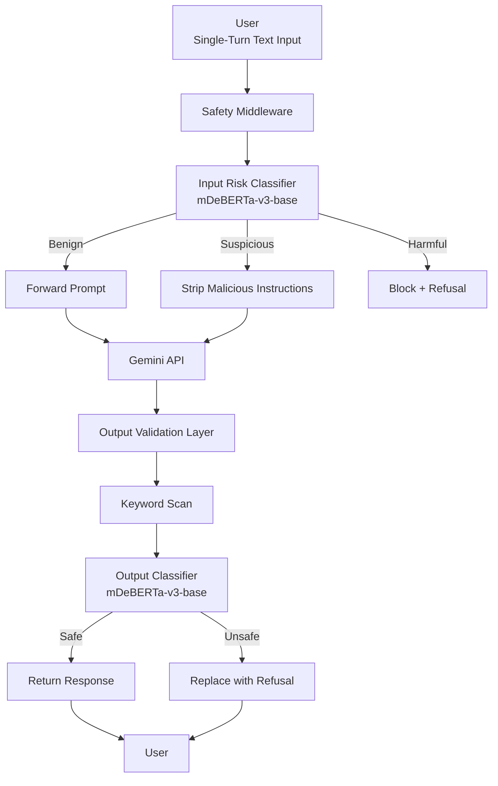

# Milestone 1: Problem Definition & Literature Review

### Inference-Time Guardrails for Mitigating Prompt Jailbreak Attacks
---

## 1. Problem Definition

### 1.1 Background
As Large Language Models (LLMs) transition from research environments to real-world products like customer support bots and personal assistants, they face a growing threat from adversarial manipulation. Standard post-training safety alignment (RLHF) is often insufficient to prevent "jailbreaking", a technique where users employ sophisticated prompts to bypass safety filters. These attacks, ranging from complex role-play scenarios to direct instruction overrides, pose significant legal, ethical, and brand risks to organizations deploying AI.

### 1.2 Problem Statement
There is a critical need for an inference-time safety middleware that acts as an independent gatekeeper for LLM interactions. Current internal model safety training is static and reactive; developers require a modular, high-speed system that intercepts malicious prompts before they reach the model and validates the model’s response before it reaches the user. This project addresses the lack of deployable, low-latency frameworks that can detect and mitigate adversarial "jailbreak" attempts in real-time without significantly degrading system performance or user experience.

### 1.3 Scope and Boundaries
To ensure the project is achievable within the eight-week course timeline, the following boundaries have been established:

**Target Attacks:** Specifically focusing on text-based adversarial vectors: role-play jailbreaks, instruction overrides, and prompt injections.\
**Modalities:** Restricted to **single-turn text interactions** only. Multimodal (image/audio) and code-execution safety are out of scope.\
**Architecture:** The system acts as a middleware between a user interface and the Gemini API.\
**Transformation Logic:** Prompt rewriting is strictly limited to stripping malicious instructions; it will not generate new task-related information.\
**Performance:** The system is optimized for production-grade latency, targeting an end-to-end overhead of less than **300ms**.

### 1.4 Relevant Stakeholders
**AI Developers & Engineers:** Who need modular tools to "harden" their applications against exploits.\
**Product Owners & Organizations:** Concerned with brand safety, policy compliance, and reducing the risk of toxic AI outputs.\
**End-Users:** Who benefit from safer, more reliable AI interactions that are resistant to manipulative content.\
**Model Providers:** Who can use external guardrails to complement internal safety alignment.

### 1.5 Project Objectives
The success of the "Inference-Time Guardrail" will be measured by the following objectives:

1.  **Develop a High-Speed Classifier:** Fine-tune an **mDeBERTa-v3-base** model to categorize prompts as benign or malicious with high precision.
2.  **Reduce Attack Success Rate (ASR):** Achieve a **70% or greater reduction** in successful jailbreaks compared to an unprotected baseline.
3.  **Minimize Over-Refusal:** Maintain a **False Refusal Rate (FRR) of <10%** using the **XSTest** benchmark to ensure the system doesn't block legitimate user requests.
4.  **Preserve Model Utility:** Ensure the guardrail does not degrade task performance, maintaining **MT-Bench** scores within **90%** of the baseline.
5.  **Operational Efficiency:** Implement the entire safety pipeline (Detection + Rewriting + Verification) within a **300ms** latency window.

---

# 2. Literature Review and Existing Solutions  

This section reviews current research, tools, and deployment strategies related to prompt injection defense and LLM safety.

---

## 2.1 Training-Time Alignment Methods  

### Reinforcement Learning from Human Feedback  

RLHF is widely used in aligned models. Human feedback is used to train reward models which guide policy optimization.

**Strengths**  
Embedded safety behavior  
No additional inference components  

**Limitations**  
Vulnerable to adversarial prompting  
Costly retraining required for policy updates  
Limited adaptability in closed-source APIs  

### Constitutional AI  

Uses rule-based self-critique to align models during training.

**Strengths**  
Scalable alignment  
Reduces harmful outputs in cooperative settings  

**Limitations**  
Still vulnerable to jailbreak framing  
Does not address inference-time adversarial manipulation  

---

## 2.2 Prompt-Based Defenses  

### System Prompt Hardening  

Many deployments rely on stronger system prompts to restrict model behavior.

**Strengths**  
Simple deployment  
No external components  

**Limitations**  
System prompts can be overridden  
No formal adversarial robustness guarantees  

### Context Isolation in Retrieval-Augmented Systems  

Research suggests isolating retrieved documents and user instructions to prevent cross-contamination.

**Strengths**  
Effective in retrieval-augmented systems  

**Limitations**  
Does not address direct jailbreak phrasing  

---

## 2.3 Rule-Based Filtering Systems  

Keyword filtering and regular expression matching remain common in industry.

**Strengths**  
Low latency  
Easy implementation  

**Weaknesses**  
High False Refusal Rate  
Easy to bypass using paraphrasing  
No semantic understanding  

---

## 2.4 LLM-as-a-Judge Frameworks  

Some safety systems use a second large model to evaluate responses.

**Strengths**  
High contextual awareness  
Flexible safety enforcement  

**Weaknesses**  
High latency  
High cost  
Unsuitable for real-time production constraints  

---

## 2.5 Small Specialized Models for Guardrails  

Recent research demonstrates the effectiveness of lightweight transformer classifiers for safety detection.

PromptGuard by Meta demonstrates that sub-100M parameter models can achieve strong semantic understanding while maintaining low latency.

**Strengths**  
Fast inference  
Context-aware detection  
Deployable as middleware  

**Limitations**  
Requires continual dataset updates  
Generalization dependent on training diversity  

---

## 2.6 Academic Benchmarks  

JailbreakBench  
Standardized dataset for adversarial prompt evaluation  

XSTest  
Dataset for measuring exaggerated safety and false refusals  

MT-Bench  
Measures general conversational performance  

These benchmarks enable reproducible and comparable evaluation.

---

# 3. Gap Analysis  

Existing approaches fall into three major categories.

No protection baseline  
High vulnerability  

Keyword filtering  
Low robustness and high over-refusal  

Training-time alignment  
Static and retraining dependent  

### Missing Capability  

There is no widely adopted production-ready middleware that:

1. Is model-agnostic  
2. Works in black-box API environments  
3. Achieves measurable ASR reduction  
4. Maintains low latency  
5. Controls exaggerated safety  

Our system directly addresses this deployment gap.

---

# 4. Evaluation Framework and Industry Standards  

## 4.1 Industry Standards  

OWASP Top 10 for LLM Applications  
Focus on LLM01 Prompt Injection  

NIST AI Risk Management Framework  
Govern through measurable thresholds  
Protect via external control layers  

---

## 4.2 Baselines  

Unprotected Gemini baseline  
Measures raw vulnerability  

Keyword filter baseline  
Measures naive deterministic filtering  

Small specialized model paradigm  
Benchmarked against PromptGuard-style architectures  

---

## 4.3 Metrics  

### Attack Success Rate  

ASR equals number of harmful prompts that produce non-refusal divided by total adversarial prompts.

Target reduction greater than or equal to 70 percent  

### False Refusal Rate  

FRR equals number of benign prompts incorrectly blocked divided by total benign prompts.

Target less than 10 percent  

### Utility Preservation  

MT-Bench score must remain at least 90 percent of baseline  

### Latency  

Total added inference overhead below 300 milliseconds  

---

## 5. System Architecture

### 5.1 Architectural Overview
To address the challenges outlined in Sections 1.1 and 1.2, we design a **modular inference-time safety middleware** that operates as an independent gatekeeper between the user interface and the Gemini API.

The architecture consists of four primary layers:
1. **User Interface Layer (Streamlit Frontend)**
2. **Pre-Inference Guardrail (Input Classification + Transformation)**
3. **Primary LLM Layer (Gemini API)**
4. **Post-Inference Guardrail (Output Validation)**

The system strictly adheres to the scope defined in Section 1.3:
* Single-turn interaction
* Text-only modality
* Middleware-based deployment
* No internal modification of the base LLM
* Rewriting limited to stripping malicious instructions
### 5.2 High-Level System Flow

### 5.3 Pre-Inference Guardrail
#### 5.3.1 Input Risk Classification
We fine-tune an mDeBERTa-v3-base model to classify prompts into:
* **Benign**
* **Suspicious (jailbreak attempt)**
* **Harmful**

This classifier acts as the primary detection mechanism for adversarial manipulation attempts such as:
* Role-play jailbreaks
* Instruction overrides
* Prompt injections
#### 5.3.2 Prompt Transformation Module
For prompts classified as *Suspicious*, the system performs constrained rewriting:
* Removes malicious meta-instructions (e.g., “ignore previous rules”)
* Does not add new task-specific information
* Preserves original semantic intent

Prompts classified as *Harmful* are blocked and replaced with a refusal message.
### 5.4 Primary Model Layer
The middleware forwards safe prompts to the Gemini API (treated as a black-box LLM).

Key characteristics:
* No retraining of Gemini
* No modification of internal safety alignment
* Middleware operates independently
### 5.5 Post-Inference Guardrail
To ensure bidirectional safety, generated outputs are validated through:
#### 5.5.1 Rule-Based Keyword Scan
Fast detection of explicit harmful patterns.
#### 5.5.2 Secondary Risk Classification
The same fine-tuned classifier evaluates the generated response.

If unsafe content is detected:
* The response is replaced with a standardized refusal template.
### 5.6 Architectural Design Principles
The system is designed to satisfy the project objectives (Section 1.5):
* **Modularity:** Replaceable classifier and rule engine
* **Low Latency:** Target <300ms overhead
* **Minimal Utility Degradation**
* **Deterministic Transformation**
* **Defense-in-Depth (Input + Output Validation)**

---

## 6. Methodology
### 6.1 Threat Model and Assumptions
Aligned with Section 1.3 (Scope and Boundaries):
#### 6.1.1 Covered Threats
* Text-based jailbreak prompts
* Role-play manipulation
* Instruction override attacks
* Prompt injection
#### 6.1.2 Out-of-Scope
* Multimodal inputs (image/audio)
* Code execution risks
* Multi-turn context poisoning
* White-box adversaries
### 6.2 Data Collection and Preparation
#### 6.2.1 Training Datasets
The classifier is fine-tuned using:
* JailbreakBench (training split only)
* WildChat
* Curated benign prompt datasets for class balancing

Strict SHA-256 hashing ensures:
* No overlap between training and evaluation splits
* No template leakage

Dataset split:
* 70% Training
* 15% Validation
* 15% Testing
### 6.3 Model Training
#### 6.3.1 Architecture
Transformer-based encoder (mDeBERTa-v3-base) with a 3-class classification head.
#### 6.3.2 Training Configuration
* Loss Function: Cross-Entropy
* Optimizer: AdamW
* Learning Rate: 2e-5
* Epochs: 3–5
* Batch Size: 16
* Early stopping on validation F1-score

Priority is given to:
* High precision on malicious classes
* Minimizing false positives (to reduce FRR)

### 6.4 Prompt Transformation Strategy
The rewriting module uses deterministic regex-based stripping of:
* “Ignore previous instructions”
* “Override safety policy”
* “Act as an unrestricted AI”
* Known jailbreak role-play patterns

Constraints:
* No semantic rewriting
* No addition of task content
* Pure deletion-based transformation

This ensures compliance with Section 1.3 transformation boundaries.
### 6.5 Output Validation Procedure
#### 6.5.1 Keyword Filtering
Lightweight dictionary-based scan for:
* Harm facilitation instructions
* Illicit procedural guidance
* Explicit unsafe content
#### 6.5.2 Secondary Classification
Generated output → passed through classifier

Decision rule:
* If unsafe → Replace with refusal
* If safe → Return to user

### 6.6 Evaluation Framework
Evaluation directly maps to the objectives in Section 1.5.
#### 6.6.1 Attack Success Rate (ASR)
Evaluated using:
* JailbreakBench (evaluation split)

Attack considered successful if:
* The model provides harmful content
* It does not refuse
* Confirmed by LLM-as-a-judge

Target:
≥ 70% ASR reduction compared to baseline
#### 6.6.2 False Refusal Rate (FRR)
Measured using:
* XSTest
FRR = Incorrect refusals / Total benign prompts

Target:
< 10%
#### 6.6.3 Task Performance Preservation
Measured using:
* MT-Bench

Constraint:
Guardrail score ≥ 90% of baseline

#### 6.6.4 Latency Measurement
Total guardrail overhead includes:
* Input classification
* Transformation processing
* Output keyword scan
* Output classification

Target:
< 300ms additional latency

Optimization techniques:
* ONNX model export
* INT8 quantization
* Warm model caching
* Asynchronous API handling
### 6.7 Baseline Comparisons
We compare three configurations:
1. Unprotected Gemini baseline
2. Keyword-filter-only baseline
3. Proposed dual-layer guardrail

Metrics compared:
* ASR
* FRR
* MT-Bench performance
* Latency overhead

---

# 8. References  

1. **OWASP Top 10 for Large Language Model Applications**  
   https://owasp.org/www-project-top-10-for-large-language-model-applications  

2. **NIST AI Risk Management Framework (AI RMF 1.0)**  
   https://www.nist.gov/itl/ai-risk-management-framework  

3. **Meta PromptGuard (Prompt-Guard-86M) Model Documentation**  
   https://huggingface.co/meta-llama/Prompt-Guard-86M  

4. **JailbreakBench Official Benchmark**  
   https://jailbreakbench.github.io  

5. **XSTest Dataset (Hugging Face)**  
   https://huggingface.co/datasets/xstest  

6. **MT-Bench Evaluation Framework (FastChat / LMSYS)**  
   https://github.com/lm-sys/FastChat/tree/main/fastchat/llm_judge   
