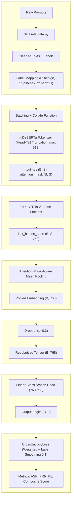

# Milestone 3: Model Architecture Design and End-to-End Pipeline Verification

## 1. Dataset Organization

The guardrail evaluation dataset (N=20,137) is strictly organized to isolate raw data caching, processing logic, and final splits to prevent data leakage during model training. The primary directory structure is localized within the `datasets/` folder:

*   **Raw Source Data (`datasets/cache/`)**: Stores locally cached JSON payloads downloaded from upstream Hugging Face repositories (e.g., `toxic-chat`, `JailbreakBench`). Caching these prevents redundant network requests and ensures pipeline reproducibility.
*   **Processed Outputs (`datasets/dataset_outputs/evaluation_dataset/`)**: Contains the consolidated, deduplicated, and unified dataset exported as JSON.
*   **Splits Directory (`datasets/dataset_outputs/evaluation_dataset/splits/`)**: The definitive location for the partitioned subsets (`train.json`, `validation.json`, and `test.json`). These splits are deterministically generated to maintain stratification across the three canonical classes: 14,093 training, 3,017 validation, and 3,027 test records.
*   **Analytics Reports (`datasets/dataset_outputs/evaluation_dataset/reports/`)**: Houses generated metadata, dataset statistics, and deep analytical insights derived from the dataset generation scripts.

Two core scripts govern this organization:
*   `data.py`: The primary engine responsible for ingestion, normalization, synthetic variation generation, deduplication, and the final deterministic split assignment.
*   `generate_deeper_insights.py`: An analytical tool that profiles class distributions, prompt lengths, and attack taxonomy frequencies to populate the `reports/` folder.

## 2. Preprocessing Pipeline

The preprocessing pipeline ensures the structural consistency of user prompts before tokenization and model inference. Two distinct normalization stages operate at different points in the pipeline.

### 2.1 Dataset-Level Normalization

During dataset construction, prompts are normalized through a multi-stage procedural filter:
- **Whitespace Collapse**: Replacing specialized whitespace characters (`\r`, `\n`, `\t`) with single space equivalents. While some adversarial signals may be embedded in complex formatting, the semantic core of most jailbreak attacks remains invariant to these structural modifications.
- **Boundary Filtering**: Discarding prompts outside the 8-character lower bound ensures the model focuses on semantically dense instructions.

### 2.2 Inference-Time Text Normalization (`_norm` Function)

At inference time, the regex pre-filter applies an aggressive normalization function (`_norm`) to maximize pattern matching coverage against obfuscated inputs. This function operates as follows:

1. **Unicode Normalization (NFKC):** Converts compatibility characters to their canonical decomposed forms. This collapses visually similar Unicode variants (e.g., fullwidth characters, superscripts) into standard ASCII equivalents, preventing trivial Unicode-based obfuscation bypasses.

2. **Leetspeak and Symbol Substitution:** A deterministic character mapping replaces common leetspeak substitutions:

    | Original | Replacement | Rationale |
    |:---|:---|:---|
    | `0` | `o` | Common leetspeak for 'o' |
    | `1` | `i` | Common leetspeak for 'i' or 'l' |
    | `3` | `e` | Common leetspeak for 'e' |
    | `4` | `a` | Common leetspeak for 'a' |
    | `5` | `s` | Common leetspeak for 's' |
    | `@` | `a` | Common substitution for 'a' |
    | `$` | `s` | Common substitution for 's' |
    | `!` | `i` | Common substitution for 'i' |
    | `7` | `t` | Common leetspeak for 't' |

3. **Non-Alphanumeric Stripping:** All characters outside `[a-zA-Z0-9\s]` are replaced with spaces, eliminating punctuation-based obfuscation.

4. **Case Folding and Whitespace Normalization:** The result is lowercased and multiple spaces are collapsed.

**Limitations and Potential Over-Generalization:** This aggressive normalization is applied exclusively to the regex pre-filter input and does not affect the text sent to the neural classifier. However, within the regex layer itself, the substitutions can introduce false positive risk. For example, the digit sequence "1045" in a mathematical prompt would be normalized to "ioas," which could theoretically match a harmful pattern. In practice, the regex patterns are sufficiently specific (matching multi-word phrases rather than isolated character sequences) that this risk is minimal. The normalization prioritizes maximizing recall for obfuscated attacks at the regex layer, while the neural classifier operating on the original text provides the precision correction for any false positives introduced.

### 2.3 Deduplication (SHA-256)

To prevent model overfitting on exact duplicates, a stable SHA-256 hash is generated for the lowercased, normalized text of each prompt. A global registry ensures only unique hashes proceed through the pipeline.

### 2.4 Leakage Prevention (Family Grouping)

When generating synthetic variations of jailbreak prompts (e.g., appending hypothetical prefixes), the system assigns a cryptographic `family_id` to link the variant to its base prompt. The splitting algorithm forces all prompts sharing a `family_id` into the exact same dataset partition (Train, Validation, or Test) to eliminate data leakage.

### 2.5 Tokenization and Head-Tail Truncation Strategy

Text is processed using the `microsoft/mdeberta-v3-base` tokenizer (SentencePiece).

- **Context Window (512 Tokens):** The maximum sequence length is set to 512 tokens, selected based on an empirical coverage analysis of the full 20,137-sample corpus.

- **Coverage Analysis:** A systematic evaluation across candidate truncation points confirms that 512 tokens covers 98.35% of the dataset (19,804 of 20,137 samples). The coverage at alternative truncation points was evaluated:

    | MAX_LENGTH | Coverage (%) | Samples Covered |
    |:---|:---|:---|
    | 64 | 66.41% | 13,373 |
    | 128 | 76.95% | 15,496 |
    | 192 | 81.49% | 16,409 |
    | 256 | 87.92% | 17,704 |
    | 320 | 90.51% | 18,225 |
    | 380 | 91.99% | 18,524 |
    | 444 | 94.92% | 19,115 |
    | 512 | 98.35% | 19,804 |

    The 512-token window was selected because it provides near-complete coverage while remaining within the encoder's native positional encoding range, avoiding the computational cost of longer sequences.

- **Head-Tail Truncation:** For the approximately 1.65% of prompts exceeding 512 tokens (primarily dense role-play jailbreaks), the system implements a head-tail truncation strategy rather than standard left-only truncation. Given a budget of `MAX_LENGTH - 2` tokens (reserving two positions for `[CLS]` and `[SEP]` special tokens), the system retains:
    - The first `(MAX_LENGTH - 2) // 2` tokens from the start of the prompt (capturing setup context and adversarial framing).
    - The last `(MAX_LENGTH - 2) - head_len` tokens from the end of the prompt (capturing the payload or terminal attack instruction).

    This strategy is motivated by the empirical observation that adversarial intent in jailbreak prompts is bimodally distributed: the initial segment typically contains persona setup or instruction-override language, while the terminal segment frequently contains the actual harmful request or payload. Standard left-only truncation would discard the latter, significantly degrading detection recall for long-form attacks.

## 3. Model Architecture

The classifier architecture is designed for low-latency sequence classification, optimized to route live user traffic through an LLM guardrail.

*   **Encoder Backbone (`microsoft/mdeberta-v3-base`)**: The architecture relies on the pre-trained DeBERTa (Decoding-enhanced BERT with disentangled attention) model. This backbone produces robust contextual embeddings utilizing a disentangled attention mechanism that separately encodes content and position, providing superior performance on semantic understanding tasks compared to standard BERT-family models. The encoder outputs a hidden state of dimension 768 for each token in the sequence.

*   **Pooling Strategy (Mean Pooling)**: The architecture aggregates the encoder's per-token hidden states using **attention-mask-aware mean pooling**. Rather than extracting only the `[CLS]` token embedding, the system computes a weighted average across all non-padding tokens:

    ```
    mask_expanded = attention_mask.unsqueeze(-1).expand(last_hidden_state.size()).float()
    pooled = sum(last_hidden_state * mask_expanded, dim=1) / clamp(mask_expanded.sum(dim=1), min=1e-9)
    ```

    This pooling strategy was selected over `[CLS]` token extraction based on the following considerations:

    - **Distributed Intent Capture:** Adversarial intent in jailbreak prompts is frequently distributed across the entire sequence rather than concentrated at the start. Mean pooling ensures that semantic signals from the body and tail of the prompt are represented in the classification vector, which is critical given the head-tail truncation strategy.
    - **Robustness to Long Sequences:** At 512 tokens, the `[CLS]` token must encode the entire sequence semantics into a single position, leading to information dilution. Mean pooling distributes this representational burden across all token positions.
    - **Empirical Performance:** In comparative experiments, mean pooling consistently outperformed `[CLS]` extraction on the jailbreak detection task, particularly for long-form role-play attacks where the malicious payload is embedded mid-sequence.

*   **Regularization and Linear Mapping**: The pooled 768-dimensional representation is passed through a Dropout layer (p=0.3) to mitigate overfitting. It then traverses a Linear classification head that maps the hidden state to 3 output logits corresponding to the canonical labels (`benign`, `jailbreak`, `harmful`).

The system is engineered as an **Inference-Time Middleware**, positioned between the user application and the LLM API (e.g., Gemini). It utilizes a **Hybrid Layered Defense** strategy:

1.  **Layer 0 (Deterministic Rules)**: A hardened regex-based pre-filter scans for high-confidence malicious patterns using compiled regular expressions with severity-weighted scoring. Prompts accumulating a cumulative severity above the block threshold (1.2) are rejected before any neural computation occurs.
2.  **Layer 1 (Neural Classification)**: The mDeBERTa-based classifier evaluates the semantic intent of prompts that pass Layer 0.
3.  **Layer 2 (Threshold-Based Decision Engine)**: A tri-modal decision layer maps classifier probabilities to system actions (ALLOW, TRANSFORM, or BLOCK) using empirically calibrated thresholds.
4.  **Layer 3 (LLM-Based Transformation)**: Prompts in the "suspicious zone" (between the transform and block thresholds) are sanitized using an external LLM (Gemini 2.5 Flash) before re-evaluation by the classifier.

The full request flow operates as follows:

1.  **Ingestion**: Raw text is loaded from the pre-computed split JSON arrays.
2.  **Dataset Construction**: PyTorch `Dataset` instances map string labels to integer IDs (`benign`=0, `jailbreak`=1, `harmful`=2).
3.  **Collation and Tokenization**: A custom collate function batches strings, invokes the mDeBERTa tokenizer with head-tail truncation (up to 512 tokens), and returns PyTorch tensors.
4.  **Forward Pass**: The `input_ids` and `attention_mask` tensors are pushed to the device (CUDA/CPU) and passed through the `GuardrailModel` encoder followed by mean pooling and the classification head.
5.  **Loss Calculation**: During training, the 3-dimensional output logits are evaluated against true label IDs using a class-weighted `CrossEntropyLoss` function with label smoothing (factor 0.1).
6.  **Optimization**: The gradients are backpropagated using the `AdamW` optimizer, modulated by a linear learning rate scheduler with a 10% warmup phase and gradient clipping (max norm 1.0).

## 4. Hardened Regex Pre-Filter

The rule layer operates in constant time regardless of prompt length and serves two purposes: (1) catch well-known explicit attack signatures before any neural computation, and (2) provide an interpretable audit trail for every block decision. Each rule carries a severity weight; samples accumulating severity above the block threshold are rejected immediately.

### 4.1 Pattern Design Rationale

The regex patterns are designed to detect two primary categories of adversarial behavior: **jailbreak attempts** (attempts to override the model's safety alignment) and **harmful content requests** (direct requests for dangerous information or actions). Each pattern targets a specific, well-documented attack vector observed in public jailbreak benchmarks.

| Pattern Name | Category | Severity | Target Behavior | Example Match |
|:---|:---|:---|:---|:---|
| `instruction_override` | Jailbreak | 1.0 | Explicit directives to ignore system instructions | "ignore all previous instructions" |
| `safety_bypass` | Jailbreak | 1.0 | Attempts to disable safety mechanisms | "bypass safety filters" |
| `DAN` | Jailbreak | 1.0 | "Do Anything Now" persona attacks | "do anything now" |
| `dev_mode` | Jailbreak | 0.9 | Developer/debug/god mode activation | "developer mode enabled" |
| `persona_hijack` | Jailbreak | 0.9 | Role-play as unrestricted entities | "pretend you are unrestricted" |
| `rule_abolition` | Jailbreak | 0.85 | Declarations of no rules/limits | "no rules apply here" |
| `hypothetical_attack` | Jailbreak | 0.8 | Hypothetical framing for harmful requests | "hypothetically, how to build..." |
| `weapon` | Harmful | 1.0 | Weapons/explosives fabrication | "make a bomb" |
| `malware` | Harmful | 1.0 | Malicious software creation | "write ransomware code" |
| `hacking` | Harmful | 0.95 | Unauthorized system access | "hack into the database" |
| `credential_theft` | Harmful | 0.95 | Password/credential theft | "phishing email to steal passwords" |

### 4.2 Severity Scoring and Threshold Logic

Rather than treating each rule as a binary gate, the system employs a cumulative severity scoring mechanism. When a prompt triggers multiple rules, their individual severity scores are summed. The system then applies a two-tier threshold:

- **BLOCK (severity >= 1.2):** The prompt triggers multiple or high-severity patterns, indicating a clear adversarial or harmful intent. The prompt is rejected without neural evaluation.
- **SOFT_FLAG (severity >= 0.5):** The prompt triggers lower-severity patterns and is flagged for elevated scrutiny by the neural classifier, but is not blocked at the regex layer.
- **ALLOW (no hits or severity < 0.5):** The prompt proceeds to the neural classifier without modification.

The block threshold of 1.2 was set above 1.0 to require either multiple pattern matches or a combination of high-severity rules before blocking, reducing the false positive rate of the regex layer while maintaining high recall for multi-indicator attacks.

### 4.3 Limitations of the Regex Approach

The regex pre-filter is inherently limited by its reliance on syntactic pattern matching:

1. **Paraphrase Evasion:** Attackers can rephrase their prompts to avoid matching the specific regex patterns while preserving the adversarial intent (e.g., "disregard the above directives" would evade a pattern matching "ignore previous instructions" if not specifically accounted for).
2. **Language Coverage:** The current patterns are English-only. Adversarial prompts in other languages or mixed-language constructions would bypass the regex layer entirely.
3. **Context Insensitivity:** The regex cannot distinguish between a benign discussion about security concepts (e.g., "explain how phishing works") and an actual malicious request. This limitation is intentionally accepted because the neural classifier (Layer 1) provides the contextual disambiguation.
4. **Normalization Dependency:** The patterns operate on the `_norm`-processed text. If the normalization function fails to decode a novel obfuscation scheme, the pattern will not match.

These limitations are by design: the regex layer is intended as a high-speed, high-recall first filter, with precision corrections delegated to the neural classifier.

## 5. Input and Output Formats

The model accepts and outputs standardized multi-dimensional PyTorch tensors. Assuming a batch size of `B`:

*   **`input_ids` Tensor**: Shape `[B, S]`, where `S` is the sequence length (dynamically padded within each batch, bounded by `max_length=512`). Contains integer token IDs produced by the SentencePiece tokenizer with head-tail truncation.
*   **`attention_mask` Tensor**: Shape `[B, S]`. Contains binary values indicating which tokens the model should attend to (`1`) and which are padding (`0`).
*   **Encoder Output**: The mDeBERTa last hidden state outputs a tensor of shape `[B, S, 768]`.
*   **Pooled Output**: The attention-mask-aware mean pooling yields a tensor of shape `[B, 768]`.
*   **Logits Output**: Following the dropout regularization and the linear projection, the final unnormalized output shape is `[B, 3]`.

## 6. Architecture Justification

The choice of `microsoft/mdeberta-v3-base` represents a strategic balance between classification performance and inference speed.

*   **Contextual Understanding**: Unlike simplistic heuristic or keyword-matching filters (which are trivially bypassed by obfuscation or complex prompt injections), mDeBERTa utilizes disentangled attention to understand the positional and contextual nuances of adversarial queries. It can detect semantic intent rather than merely forbidden vocabulary.
*   **Efficiency**: As an encoder-only architecture, it is significantly faster and cheaper to run as an intermediate guardrail compared to routing queries through a secondary, heavy decoder-based LLM. The 512-token context window covers 98.35% of the evaluation corpus while maintaining low computational overhead (~5.8ms per sample on a T4 GPU).

## 7. Formal Training Specification

To ensure a reproducible and robust training process, the `GuardrailModel` was optimized using a rigorously defined hyperparameter configuration. These parameters were identified through a systematic random search of 99 trials (see `notebooks/Final_HPT.ipynb` and `notebooks/hp_outputs/`) across learning rates, batch sizes, dropout values, and truncation lengths. The HPT process identified MAX_LENGTH=444 as the locally optimal truncation point based on composite score maximization. However, the final production configuration uses MAX_LENGTH=512 (see `notebooks/Final Guardrail.ipynb`) because the additional coverage (98.35% vs. 94.92%) captures substantially more long-form adversarial prompts, justified by the head-tail truncation strategy that preserves both preamble and payload without significant latency increase.

| Hyperparameter | Value | Rationale |
| :--- | :--- | :--- |
| **Max Epochs** | 15 | Upper bound for training duration, governed by early stopping. |
| **Batch Size** | 4 | Small batch size provides noisier but more regularizing gradient estimates, which improves generalization on this security-critical task. Also necessary to accommodate 512-token sequences within T4 GPU memory (16GB VRAM). |
| **Learning Rate** | 3e-5 | Selected from candidates [1e-5, 2e-5, 3e-5, 5e-5]. Higher than the common 2e-5 default to compensate for the smaller batch size, providing sufficient gradient magnitude per update step. |
| **Warmup Ratio** | 0.1 | 10% of total steps dedicated to initial LR ramp-up to prevent early training instability. |
| **Weight Decay** | 0.01 | L2 regularization applied through AdamW to prevent overfitting on the training distribution. |
| **Dropout Rate** | 0.3 | Probability of hidden unit deactivation. Increased from the typical 0.1-0.2 range to provide stronger regularization given the small batch size. |
| **Gradient Clipping** | 1.0 | Maximum gradient norm to prevent gradient explosion during training, particularly important for longer sequences. |
| **Early Stopping Patience** | 3 | Number of epochs without validation macro-F1 improvement before training is terminated. Prevents overfitting while allowing sufficient time for convergence. |
| **Label Smoothing** | 0.1 | Softens the target distribution by redistributing 10% of the probability mass across non-target classes. This prevents the model from becoming overconfident in its predictions and improves calibration of the softmax probabilities, which is critical for the threshold-based decision layer. |
| **Optimization** | AdamW | Adaptive Moment Estimation with decoupled Weight Decay. |

### 7.1 Hyperparameter Selection Methodology

The final hyperparameter configuration was identified through a multi-phase process:

1. **Literature-Informed Initialization:** Initial parameter ranges were derived from established fine-tuning practices for DeBERTa-family models. The learning rate range [1e-5, 2e-5, 3e-5], batch sizes [4, 8, 16], dropout values [0.1, 0.2, 0.3], max lengths [256, 380, 444, 512], weight decay [0.01, 0.05, 0.1], T_BLOCK [0.4–0.8], and T_TRANSFORM [0.2–0.4] were established as the search space.

2. **Random Search Exploration (99 Trials):** A random search of 99 trials was conducted over the defined parameter space (see `notebooks/Final_HPT.ipynb` and results in `notebooks/hp_outputs/hpo_results.csv`). For each sampled configuration, a model was trained with early stopping and evaluated on the validation set using the composite scoring function (Section 10). Random search was preferred over grid search based on Bergstra and Bengio (2012), who demonstrated that random search finds near-optimal configurations with fewer trials when the objective function has low effective dimensionality. In our case, learning rate and max length had the largest effects, while dropout and warmup ratio had smaller marginal impacts.

3. **Composite-Score-Driven Selection:** The configuration maximizing the composite score on the validation set was selected. The HPT process identified MAX_LENGTH=444, BS=4, LR=3e-5, DROPOUT=0.3 as the locally optimal configuration (composite score=0.9121 on the HPT test subset). The full HPT results including sensitivity analyses are stored in `notebooks/hp_outputs/final_summary.json`.

4. **Production Override (MAX_LENGTH=512):** While the HPT found MAX_LENGTH=444 as locally optimal on the smaller HPT evaluation subset (N=233), the production model uses MAX_LENGTH=512 for the following reasons: (a) the 512-token window covers 98.35% of the corpus vs. 94.92% for 444, providing better coverage for long-form attacks; (b) the head-tail truncation strategy ensures that the additional tokens are used effectively; (c) the production model trained on the full training set (N=14,093) with MAX_LENGTH=512 achieves superior performance (F1=0.9544 model-only, composite=0.9495) compared to the HPT-subset results.

5. **Memory-Constrained Refinement:** The batch size of 4 was partially constrained by GPU memory: 512-token sequences with the mDeBERTa encoder require approximately 3.8GB of VRAM per batch element during backpropagation. A batch size of 4 utilizes approximately 15GB of the T4's 16GB VRAM, leaving minimal headroom.

### 7.2 Loss Optimization and Class Weighting

Given the inherent class imbalance (where `benign` samples outnumber `harmful` samples by a factor of approximately 3.4:1 in the training set), the standard Cross-Entropy loss was modified using deterministic **Inverse-Frequency Weighting**:

$$w_c = \frac{N_{total}}{K \times N_c}$$

- $N_{total}$: Total training samples (14,093).
- $K$: Number of classes (3).
- $N_c$: Number of samples in class $c$.

The raw weights are clamped to the range [0.5, 5.0] to prevent extreme weighting that could destabilize training. This weighting ensures that misclassifications of minority classes (particularly `harmful`, the primary security threat) are penalized more heavily during backpropagation, effectively prioritizing **safety recall** over raw accuracy.

Additionally, **label smoothing** (factor 0.1) is applied to the weighted cross-entropy loss. This combination serves a dual purpose: the class weights address the data imbalance, while the label smoothing prevents the model from producing overconfident softmax scores. Well-calibrated probability outputs are essential because the downstream threshold-based decision engine (Section 9) relies on the magnitude of the attack probability to determine whether a prompt should be allowed, transformed, or blocked.

## 8. End-to-End Pipeline Verification

The pipeline's mechanical and logical integrity was validated through multiple verification stages:

1.  **Mechanical Verification**: Ensuring that all data loaders, model forward/backward passes, tensor shapes, and checkpointing cycles execute without runtime exceptions on both CPU and CUDA devices.
2.  **Security Logic Verification**: Confirming that the end-to-end inference flow correctly routes through the Hybrid Defense Layers. This involves verifying that prompts are correctly normalized, tokenized, classified, and then subjected to the tri-modal decision policy (Block/Allow/Transform).
3.  **Performance Reliability**: Testing the stability of loss convergence over multiple epochs to ensure that the AdamW optimizer, class-weighting logic, and label smoothing are functioning as expected.
4.  **Reproducibility**: All experiments use a fixed random seed (42) applied to Python's `random`, NumPy, and PyTorch (including CUDA). This ensures that training runs, data shuffling, and dropout behavior are deterministically reproducible.

## 9. Decision Thresholds and Calibration Strategy

The operational guardrail requires a calibrated **Post-Hoc Decision Policy** to map softmax probabilities to system actions. Two thresholds govern this mapping:

### 9.1 Threshold Definitions

1. **Block Threshold (T_BLOCK = 0.8):** If $\max(P(\text{jailbreak}), P(\text{harmful})) \geq 0.8$, the prompt is blocked immediately. This high threshold ensures that only prompts with strong adversarial signal are categorically rejected, minimizing false refusals.

2. **Transform Threshold (T_TRANSFORM = 0.3):** If $\max(P(\text{jailbreak}), P(\text{harmful})) \in [0.3, 0.8)$, the prompt enters the "suspicious zone." It is sanitized using an LLM-based transformation (Gemini 2.5 Flash) and then re-evaluated by the classifier. If the re-evaluation classifies the transformed prompt as benign, it is allowed; otherwise, it is blocked.

3. **Allow (below T_TRANSFORM):** If $\max(P(\text{jailbreak}), P(\text{harmful})) < 0.3$, the prompt is passed directly to the LLM.

### 9.2 Threshold Selection Methodology

Optimal thresholds were identified through a systematic sweep across the range [0.15, 0.90] in increments of 0.05 on the validation set. For each candidate threshold, the system evaluated:

- Macro F1 score
- Attack Success Rate (ASR)
- False Refusal Rate (FRR)
- Composite score (Section 10)

The sweep was conducted under two conditions: model-only (no regex pre-filter) and full pipeline (regex + model). The threshold maximizing the composite score on the validation set was selected for each condition. The optimal thresholds are explicitly marked on the threshold sweep visualization plots for clarity.

### 9.3 Confidence Interpretation

The thresholds operate on softmax probabilities, whose calibration is improved by the label smoothing applied during training. Without label smoothing, the model tends to produce near-1.0 probabilities for confident predictions, collapsing the effective dynamic range of the threshold-based decision layer. With label smoothing, the probability distribution is spread more uniformly, providing a wider operating range for the threshold sweep and more granular control over the safety-utility tradeoff.

## 10. Loss Functions, Metrics, and Composite Scoring

The model is optimized using `CrossEntropyLoss` with inverse-frequency class weighting and label smoothing. The evaluation suite calculates both standard classification metrics and guardrail-specific operational metrics.

### Standard Classification Metrics:
*   **Accuracy**: Overall proportion of correctly classified instances.
*   **Precision/Recall/F1 Score**: Calculated on a per-class basis (and combined via Macro-F1) to assess performance across all three categories.

### Guardrail-Specific Metrics:
*   **Attack Success Rate (ASR)**: The percentage of malicious queries (jailbreak/harmful) that successfully bypassed the guardrail (i.e., were incorrectly classified as `benign`). Reported both overall and per-attack-class (ASR_jailbreak, ASR_harmful).
*   **False Refusal Rate (FRR)**: The percentage of safe, legitimate user queries (`benign`) that were unnecessarily blocked or transformed by the model.

### 10.1 Composite Scoring Function

To enable principled multi-objective hyperparameter selection and threshold calibration, a composite scoring function was defined:

$$S = W_{F1} \times F1 + W_{ASR} \times (1 - ASR) + W_{FRR} \times (1 - FRR)$$

The weights are:
- **$W_{F1} = 0.3$** (Classification performance)
- **$W_{ASR} = 0.5$** (Attack detection, safety)
- **$W_{FRR} = 0.2$** (Usability, false refusal avoidance)

**Weight Rationale:** These weights reflect the asymmetric cost structure of errors in safety-critical systems:

1. **ASR receives the highest weight (0.5)** because a missed attack (false negative) represents a direct security failure. In production deployment, even a small number of successful jailbreaks can result in harmful content generation, with potential legal, compliance, and reputational consequences. The cost of a single successful attack substantially exceeds the cost of a single false refusal.

2. **F1 receives moderate weight (0.3)** because overall classification accuracy is necessary for the system to function reliably. A model that simply blocks everything would achieve ASR=0% but would be unusable. F1 captures the general discriminative quality of the classifier across all three classes.

3. **FRR receives the lowest weight (0.2)** because while false refusals degrade user experience, they do not constitute a security vulnerability. A slightly elevated false refusal rate is preferable to a system that permits adversarial prompts.

These weights were determined through a combination of domain reasoning about the relative costs of failure modes in safety-critical applications and empirical validation that the resulting composite score selects configurations with the desired safety-utility balance. No formal hyperparameter optimization was applied to the weights themselves, as they encode a design priority rather than an empirically tunable parameter.

## 11. Systematic Error Analysis and Results Analysis

To ensure the guardrail's reliability, a systematic error audit is conducted on the full test split (N=3,027):

1.  **Confusion Matrix Analysis**: Identifying specific class overlaps (e.g., `jailbreak` prompts misclassified as `benign`, `harmful` misclassified as `jailbreak`).
2.  **Failure Mode Categorization**: Every misclassified sample is categorized into one of three failure modes:
    - **False Negative (FN):** An attack prompt (jailbreak or harmful) incorrectly classified as benign. This is the most safety-critical failure.
    - **False Positive (FP):** A benign prompt incorrectly classified as jailbreak or harmful.
    - **WRONG_TYPE:** An attack prompt classified as the wrong attack type (e.g., jailbreak classified as harmful). While technically an error, this is a "safe failure" because the system still triggers a BLOCK action.
3.  **Regex Hit Correlation**: Each misclassified sample is cross-referenced with the regex pre-filter to determine whether any patterns were triggered. This reveals whether regex coverage gaps contribute to specific failure modes.
4.  **Confidence Distribution Analysis**: The attack probability distribution across failure modes is plotted to determine whether errors are concentrated near the decision boundary (suggesting threshold sensitivity) or represent high-confidence misclassifications (suggesting fundamental model limitations).

## 12. System Diagram


