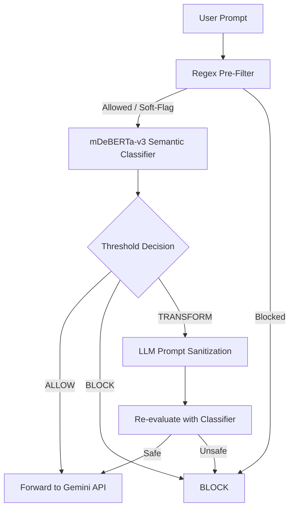

# Guardrail Classifier — Overview

## Purpose

Large Language Models (LLMs) deployed in production environments remain vulnerable to **prompt jailbreak attacks**, which exploit instruction‑following behavior through techniques such as role‑play framing, instruction overrides, and prompt injection.

The objective of this project is to implement a **production‑ready, inference‑time guardrail** that mitigates such attacks **without modifying or retraining the underlying LLM**. The system is designed to operate in black‑box API settings while maintaining **low latency**, **interpretability**, and a balanced **safety–utility trade‑off**.

***

## Architecture Summary

The guardrail is implemented as an **inference‑time middleware** positioned between the user interface and the downstream LLM (Gemini API). Each incoming prompt is synchronously processed through a **hybrid defense‑in‑depth pipeline** before any LLM invocation occurs.

### High‑Level System Flow

***

## Deployed Components

**Frontend**

*   Streamlit-based web interface
*   Accepts user prompts and displays guardrail decisions (ALLOW / BLOCK / TRANSFORM)

**Guardrail Backend**

*   Python implementation of the full inference pipeline (regex filtering, semantic classification, threshold-based decision logic)
*   Executes locally within the deployment environment

**Semantic Model**

*   Fine-tuned `microsoft/mdeberta-v3-base` encoder
*   Encoder-only architecture optimized for low-latency inference

**External LLM**

*   Gemini API
*   Used as the downstream LLM and optionally for prompt transformation
*   All calls are gated by the guardrail with safe fallback behavior

**Deployment**

*   The guardrail is deployed as a **Streamlit application hosted on Hugging Face Spaces**.

***

## Summary

This project demonstrates that effective prompt jailbreak mitigation can be achieved entirely at inference time using a layered, modular architecture. By combining deterministic rules, semantic classification, calibrated thresholds, and optional prompt transformation, the system provides a practical, low-latency guardrail suitable for real‑world LLM deployments.

